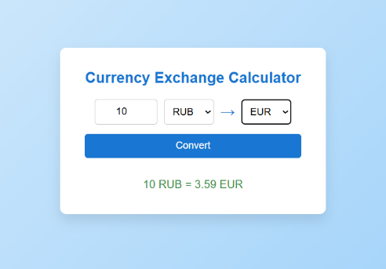

# Currency Exchange Calculator 💱

A simple React application for converting currencies using real-time exchange rates.

## 🚀 Live Demo
https://vercel.com/katerina2391s-projects/exchange-calculator/CFY3QLVvTaQULnMPENNw8jJ9GnLC

## 📌 Description
This project is a currency converter built with React. It allows users to convert amounts between different currencies using real-time exchange rates from a public API.

## ⚙️ Features
- Select source and target currencies
- Convert currency amounts in real time
- Input validation (prevents negative or zero values)
- Loading state during API requests
- Error handling for failed requests
- Automatic currency list loading

## 🛠️ Tech Stack
- React
- JavaScript (ES6+)
- Fetch API
- CSS

## 🌐 API
Exchange rates provided by:
https://www.exchangerate-api.com/

## 📷 Preview


## 📦 Installation & Setup

```bash
npm install
npm run dev